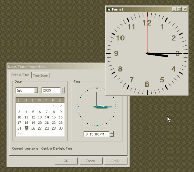



## Easy Analog Clock

### Description

Yet another Analog Clock, that actually displays an analog clock to the nearest second. When providing a 'display' its all about appearance, and this one has all the parts in place. Also, the math involved is trivial compared to the rest of the code needed to draw the clock. Isn't it supposed to be this easy? &lt;g&gt;
 
### More Info
 

             |
---                |---
**Submitted On**   |2005-07-25 15:48:42
**By**             |[Larry Serflaten](https://github.com/Planet-Source-Code/PSCIndex/blob/master/ByAuthor/larry-serflaten.md)
**Level**          |Intermediate
**User Rating**    |5.0 (30 globes from 6 users)
**Compatibility**  |VB 4\.0 \(32\-bit\), VB 5\.0, VB 6\.0
**Category**       |[Miscellaneous](https://github.com/Planet-Source-Code/PSCIndex/blob/master/ByCategory/miscellaneous__1-1.md)
**World**          |[Visual Basic](https://github.com/Planet-Source-Code/PSCIndex/blob/master/ByWorld/visual-basic.md)
**Archive File**   |[Easy\_Analo1917357252005\.zip](https://github.com/Planet-Source-Code/larry-serflaten-easy-analog-clock__1-61901/archive/master.zip)

